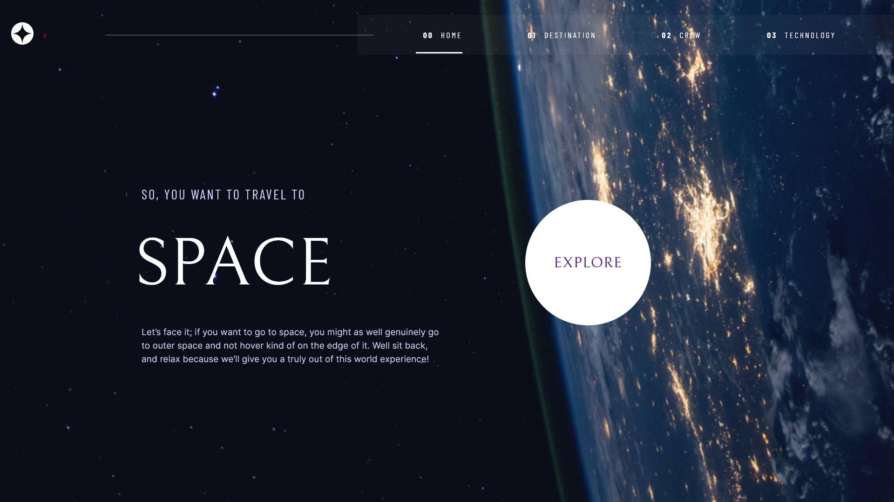

# Frontend Mentor - Space tourism website solution

This is a solution to the [Space tourism website challenge on Frontend Mentor](https://www.frontendmentor.io/challenges/space-tourism-multipage-website-gRWj1URZ3). Frontend Mentor challenges help you improve your coding skills by building realistic projects.

## Table of contents

- [Overview](#overview)
  - [The challenge](#the-challenge)
  - [Screenshot](#screenshot)
  - [Links](#links)
- [My process](#my-process)
  - [Built with](#built-with)
  - [What I learned](#what-i-learned)
  - [Continued development](#continued-development)
  - [Useful resources](#useful-resources)
- [Author](#author)

**Note: Delete this note and update the table of contents based on what sections you keep.**

## Overview

### The challenge

Users should be able to:

- View the optimal layout for each of the website's pages depending on their device's screen size
- See hover states for all interactive elements on the page
- View each page and be able to toggle between the tabs to see new information

### Screenshot

### Links

- Live Site URL: [Add live site URL here](https://space-tourism-dq33vvrpt-jacked-99.vercel.app/)

## My process

### Built with

- Semantic HTML5 markup
- CSS custom properties
- Flexbox
- CSS Grid
- Mobile-first workflow
- [React](https://reactjs.org/) - JS library
- [React-router](https://reactrouter.com/en/main/) - For routing
- [Scss](https://sass-lang.com/) - For styles
- [Vite](https://vitejs.dev/)

### What I learned

This project was a nice refresher after long break from serious coding. I was mostly focused on Sass functions, so I learned how to use mixins and variables. But this project also helped with React skills.

### Continued development

There is still much more for me to learn about accessibility. I also want to focus on creating better code and more reusable components.

### Useful resources

- [mdn](https://developer.mozilla.org/en-US/) - This page need no introduction. It was almost always opened douring creation of this project.
- [react-docs](https://react.dev/) - This amazing docs served were very usefull in reminding me how react hooks work.

## Author

- Website - [My website](https://portfolio-seven-delta-81.vercel.app/)
- Frontend Mentor - [@Jacked-99](https://www.frontendmentor.io/profile/Jacked-99)
